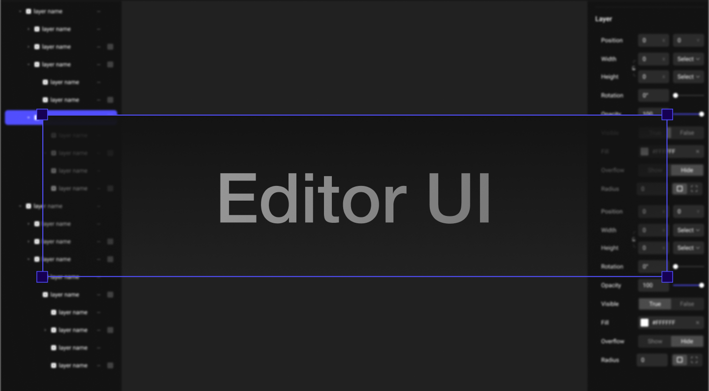

# Reflect Editor UI

> React UI Framework for creating productivity applications. - officially supported by [reflect-ui](https://reflect-ui.com)


## Installation

```shell
yarn add @reflect-ui/editor-ui
```


## Usage

```tsx
import { PropertyCell, PropertyItem, PropertyLabel } from "@reflect-ui/editor-ui"


function PropertyList(){
  return (
  	<PropertyItem>
      <PropertyLabel>Rotation</PropertyLabel>
      <PropertyCell>
        <PropertyInput type="rotation"/>
      </PropertyCell>
    </PropertyItem>
  );
}
```

## Design
Reflect Editor UI's Original design file is opened and available [here][design_file_source]


## Contributing

- **join chromatic** with this [link](https://www.chromatic.com/builds?appId=606833a032dc6f0021869fe0) you'll get instant access to reflect-editor-ui chromatic
- **read contributing.md** [here](./CONTRIBUTING.md)
- **check out the design file** [here][design_file_source]


## Used by

- [nothing.app](https://nothing.app) - [github](https://github.com/bridgedxyz/nothing)

- [surf.codes](https://surf.codes/) - [github](https://github.com/surfcodes/surf)

- [Bridged](http://bridged.xyz/) - [github](https://github.com/bridgedxyz/bridged)

- [designto.codes](http://designto.codes/) - [github](https://github.com/bridgedxyz/design-to-code)

  
[design_file_source]: https://www.figma.com/file/g7ly2MT4hQfoGr7sAvw5FO/editor-ui?node-id=133%3A5909
